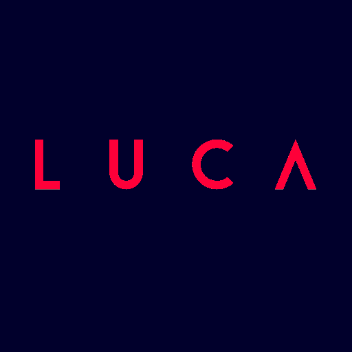

# Luca &middot;  

Tiny [NPM package](https://www.npmjs.com/package/luca) to check urls by name list and getting statuses.

## Installation

-   For cli usage install the package globally `npm i luca -g`

## CLI Usage

-   Get docs `luca -h`

## Development

-   main lib dev `yarn dev` and work with dev.ts file
-   cli dev `yarn dev:cli <comand> [options]`
